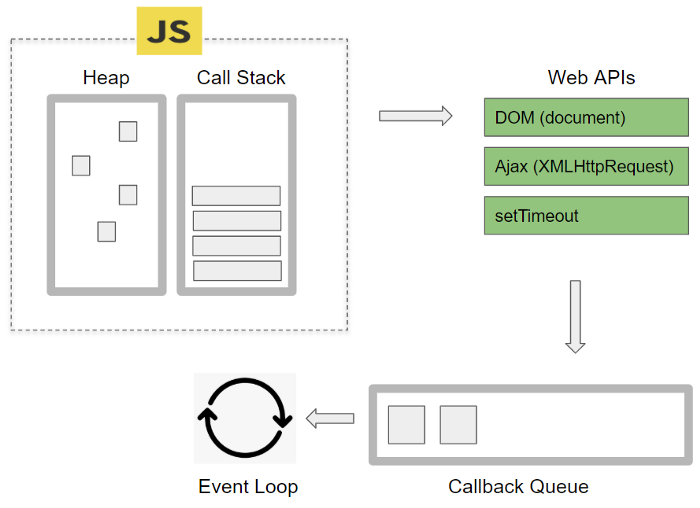

# 자바스크립트가 이벤트 루프

```
function main(){
  console.log('First');
  setTimeout(
    function display(){ console.log('Second'); }
  ,0);
	console.log('Third');
}
main();
```

자바스크립트는 싱글스레드인데 어떻게 비동기 처리가 가능할까?

1. 자바스크립트는 **단일 스레드** 기반의 언어로 한 번에 하나의 작업만을 처리할 수 있다.
    1. 자바스크립트 엔진은 단일 스레드이기 때문에 한번에 한가지 일만 가능하다
    2. 그렇기 때문에 자바스크립트에서 비동기를 처리하는 핵심요소는 브라우저 엔진이나 노드가 가지고 있다.

# 브라우저의 기본 구조



1. 자바크립트 엔진
    1. heap : 메모리가 할당되는 공간
    2. call stack : 실행 된 코드의 환경을 저장하는 자료구조
        1. 부모 함수가 끝나기 전까지 계속해서 쌓이고 call stack가 없으면 프로그램이 종료
        2. stack 구조로 현재 함수가 호출된 곳을 알 수 있다.
    3. Web Apis : 브라우저에서 제공하는 API로 DOM, Ajax, TimeOut 등이 있다.
        1. CallStack에서 실행된 비동기 함수는 Web API를 호출하고, Web API는 콜백 함수를 Task Queue에 넣는다.
        2. Node의 경우 node Api가 있다.
    4. Callback Queue : 비동기 함수가 들어오면 여기서 대기하는 공간
        1. Event Loop가 계속해서 call stack가 비워지는 지 확인하고
        2. 비워지면 차례대로 callback queue에 있는 함수를 실행한다.
    
    # 예시
    
    ```jsx
    function main(){
      console.log('First');
      setTimeout(
        function display(){ console.log('Second'); }
      ,0);
    	console.log('Third');
    }
    main();
    
    //	Output
    //	First
    //	Third
    //  Second
    ```
    
    1. main 함수가 call stack에 push된다.
    2. First 출력
    3. setTimeout가 callback queue에 push된다.
    4. Third 출력
    5. main 함수가 call stack에서 pop된다.
    6. 이벤트 루프가 call stack가 비워진걸 확인하고 callback queue에 있는 함수를 실행한다.
    7. Second를 출력한다.